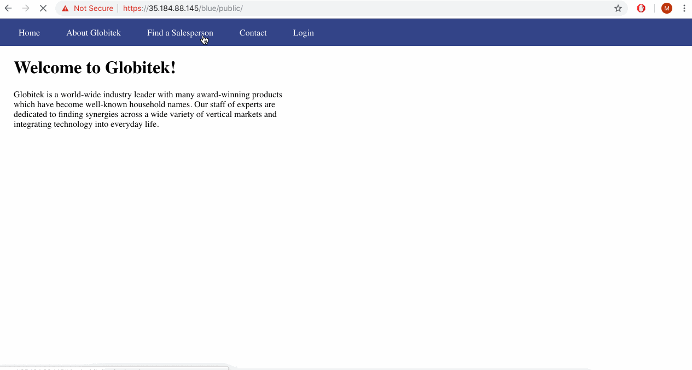
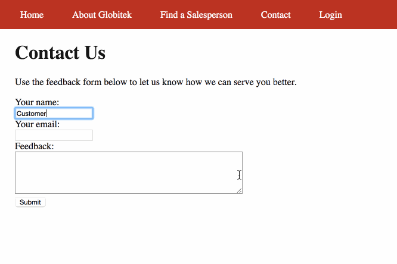

# Web Security CP week 8

# Week 8

Time spent: **10** hours spent in total

> Objective: Identify vulnerabilities in three different versions of the Globitek website: blue, green, and red.

The six possible exploits are:
* Username Enumeration
* Insecure Direct Object Reference (IDOR)
* SQL Injection (SQLi)
* Cross-Site Scripting (XSS)
* Cross-Site Request Forgery (CSRF)
* Session Hijacking/Fixation

Each version of the site has been given two of the six vulnerabilities. (In other words, all six of the exploits should be assignable to one of the sites.)

## Blue

Vulnerability #1: SQL Injection (SQLi)
  * GIF Walkthrough:
    
  * Description: Using SQL injection to the id attribute of each section (Blue, Green and Red), we can see from above that trying to use a sql injection like ``` ' OR 1=1'-- ``` in the Blue section we receive the message "Database query failed." Additionally, for the Red and Green sections the SQL injection statement redirected the screen and it cannot do any change to them.

Vulnerability #2: Session Hijacking/Fixation
  * GIF Walkthrough:
    
  * Description: Login in to the Blue section, and once logged in change the url from ```public/... ``` and onwards to ``` public/hacktools/change_session_id.php ```. Also, from this the session ID is retreived. Essentially, I can log in in one browser and get the session ID which can be used by a past login process in another browser. This hacking method demonstrates that the session can be hijacked and user informations can be stolen.


## Green

Vulnerability #1: Username Enumeration
 * GIF Walkthrough:
   
 * Description: As you can see from above, the GIF illustrates that when you enter in a username that exisits in the system/database along with a random password and you inspect the page the class of the span HTML attribute is ```failure```. Also, when a wrong username/ a username that isn't in the system is entered with a random password, inspect will display ```failed```.

Vulnerability #2: Cross-Site Scripting
 * GIF Walkthrough:
   
 * Description: (Steps to recreate) In the Green section, click on ```Contact``` and enter into the form, where in the Feedback textbook write a alert script such as ```hi<script>alert(1)</script>```. Then login and from there, click on ```Feedback``` on the dashboard and you will encounter your Feedback lssert pop-up.
 NOTE: From the GIF, it can be seen that other alert pop-ups are also encountered; they are feedbacks that are already in the system submitted by others, but our recent feedback input will be shown last.

## Red

Vulnerability #1: Insecure Direct Object Reference (IDOR)
 * GIF Walkthrough:
   
 * Description: Find sales person/people that is/are not listed in the ``` Find a Salesperson``` in any of the sections. In order to achieve this, click on an exisiting salesperson and in the url set the ```id``` attribute to different id numbers such as 9, 10, 11, etc..

Vulnerability #2: Cross-Site Request Forgery (CSRF)
 * GIF Walkthrough:
   
 * Description: In this exploit, we can see from the GIF that the user who doesn't have admin privilege can still access the website's data and change it.

Bounus:

## Notes

Describe any challenges encountered while doing the work

## Resources

GIFs created with [LiceCap](http://www.cockos.com/licecap/).

## License

    Copyright [2018] [Martin Li]

    Licensed under the Apache License, Version 2.0 (the "License");
    you may not use this file except in compliance with the License.
    You may obtain a copy of the License at

        http://www.apache.org/licenses/LICENSE-2.0

    Unless required by applicable law or agreed to in writing, software
    distributed under the License is distributed on an "AS IS" BASIS,
    WITHOUT WARRANTIES OR CONDITIONS OF ANY KIND, either express or implied.
    See the License for the specific language governing permissions and
    limitations under the License.
